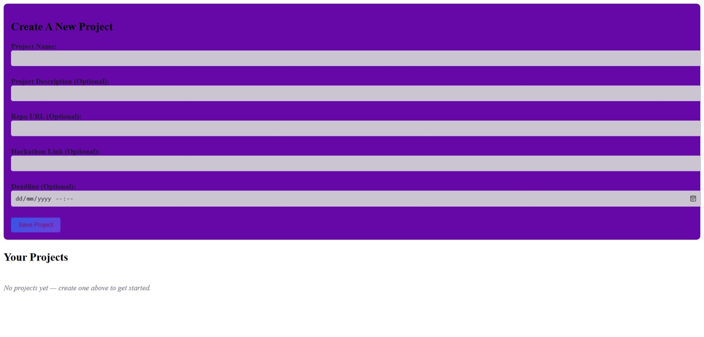

# Project Pulse
A website inspired by Hackatime, Created this website with the purpose on tracking hackathon, uncompleted projects and their deadlines  

## ScreenShot

## Try It
[Demo Link](https://temi-ay.github.io/ProjectPulse/)

To try just open the link and try it

## Vision
 I wanted something similar to hackathon but to track hackathons and YSWS projects I do. 
 The plan was each project with the Hackathons/YSWS they are aimed for have a project card
 and deadlines. As the deadline draws closer a notification popped up reminding you once in a while
 and timer to track the session you spend on the project each day
 I also wanted to implement a streak system as well as an xp systems like game for a sense of achievement after completing the tasks
 And possibly a player stats that reflects your commitment

For now my project doesn't look like it but it is something I hope to work towards
## Features
__Timer__: Tracks time spent on each project with a simple start/stop, logging every session

__Checklist__: Breaks project into smaller tasks to check off

__Project Cards__: Displays your Project

__Deadlines__: Gives a countdown to each project deadline

__Tasks List__: Helps keeps tabs on what to do next

## How it works
 __HTML__ for the Structure
 
 __CSS__ for the styling
 
 __JavaScript__ for the functionality
## Credits 
[Grace](https://github.com/Temi-ay)
